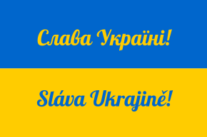
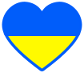

= Слава Україні! / Sláva Ukrajině!
:gh-name: jirutka/slava-ukrajine
:gh-raw-url: https://github.com/{gh-name}/raw/master

== Vlajka

link:{gh-raw-url}/vlajka-slava-ukrajine.svg[[SVG]] link:{gh-raw-url}/vlajka-slava-ukrajine.pdf[[PDF (A4)]]

== Srdce

link:{gh-raw-url}/ukrajinske-srdce.svg[[SVG]]

== Leták Stojíme za Ukrajinou

link:{gh-raw-url}/letak-stojime-za-ukrajinou.pdf[[PDF (A4)]]

== Licence

Veškeré soubory v tomto repozitáři jsou uvolněny pod licencí https://creativecommons.org/publicdomain/zero/1.0/[CC0].
